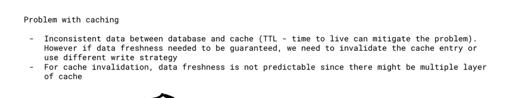
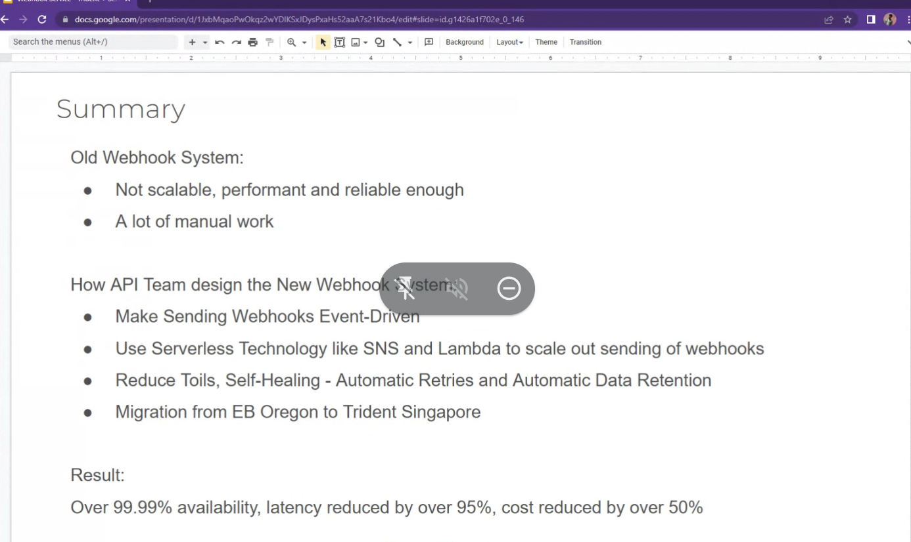
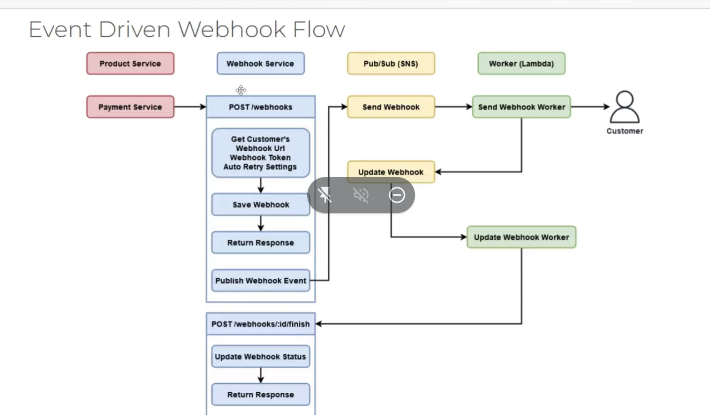
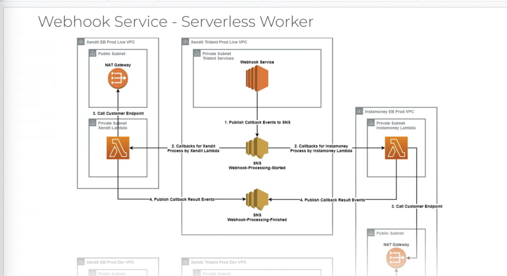

https://docs.aws.amazon.com/whitepapers/latest/database-caching-strategies-using-redis/caching-patterns.html

不同的 cache 策略

https://stackshare.io/stackups/amazon-elasticache-vs-redis#:~:text=ElastiCache%20supports%20Memcached%20and%20Redis,lists%2C%20sets%20and%20sorted%20sets.

but i had an issue when AWS EOL some of redislabs underlying infra and gave me a potential sev1 scenario

so i rather we go elasticache straight unless there are some things only redislabs can give, then that one we need to see how to manage it for reliability moving forward

Since you're implementing it yourself, and it's based on a single table, what key do you use for caching? (sql statements?

define your own compisite keys, just skip the sql exec

