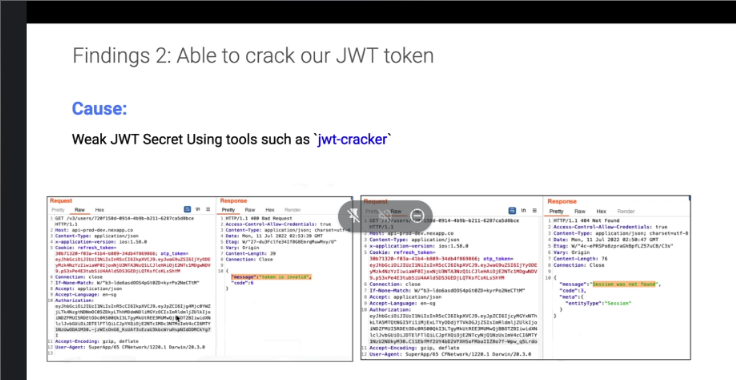

https://stackoverflow.com/questions/54684928/how-to-use-parameterized-query-using-typeorm-for-postgres-database-and-nodejs-as

https://stackoverflow.com/questions/8263371/how-can-prepared-statements-protect-from-sql-injection-attacks

