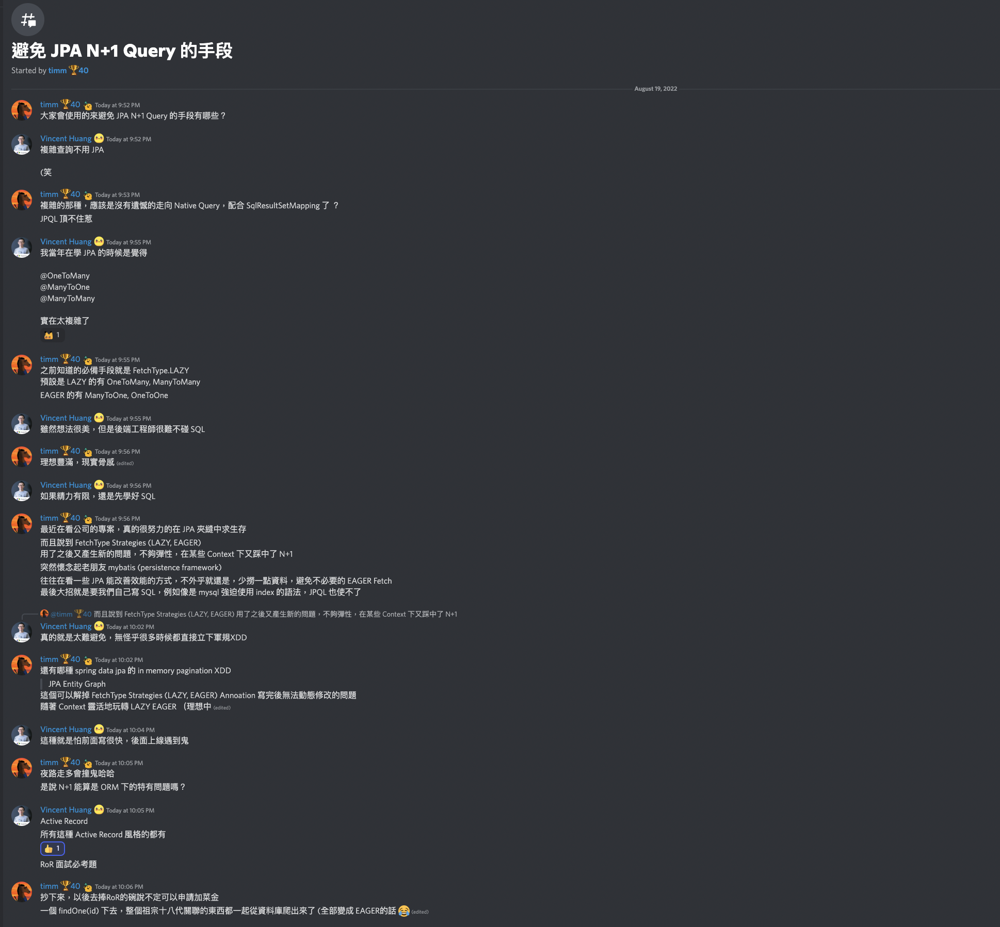
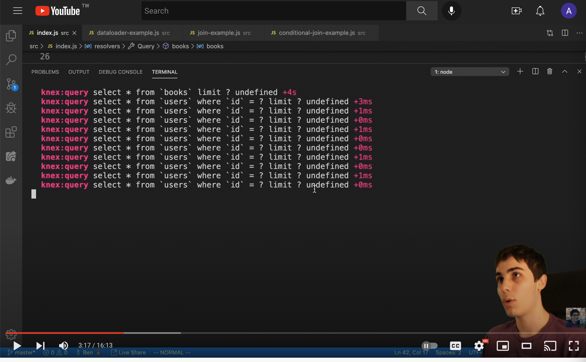

正好在某 discord 群組看到的 N+1 問題之討論

---

其實 N+1 問題現在應該也算廣為人知了

簡單來說，N+1 問題就是當你把關聯式資料庫試著物件化，不論是使用 ORM，或甚至是定義一個新的 schema 來表現他（graphql）

跟據你工具所提供自動/lazy join 來取得資料的方式，可能會導致你明明是想取得某些 entity `A`s，並且他們對應到的 `A.B`s

正常用 sql 寫，這會是一個效能不差的 join statement，而 A 跟 B 會只在單一個 statement 裡被撈出來

---

但當 N+1 問題發生時，當你去 explain/debug 時，你會發現實際跑的 sql statement 數量是 A.length + 1 https://www.youtube.com/watch?v=uCbFMZYQbxE



原因是 B 可能因為你工具的內部實作，被解析成每個都是要獨立去抓的 relation，而導致實作上不是 join，而是獨立抓來，並且 assign 成 `A.B`

---

在不同的環境/框架下會發生的可能性有不少，這裡就不贅述了，但在 GraphQL/RoR（尤其是 active record pattern） 算是一個老問題

這邊只是想來觀察一下，為什麼現在手邊的 TypeORM 專案都很少踩到，參考這篇答案

https://stackoverflow.com/questions/68981877/how-do-i-cause-n-1-problems-with-nestjs-typeorm

---

```typescript
@Entity('COMPANY')
export class Company extends TimeStamped {
    @PrimaryGeneratedColumn('increment')
    companyId: number;

    @Column({ type: 'varchar' })
    companyName: string;

    @OneToMany(() => Employee, (employee) => employee.company, {
        onDelete: 'CASCADE'
    })
    employee: Employee[];
}

@Entity('EMPLOYEE')
export class Employee extends TimeStamped {
    @PrimaryGeneratedColumn('increment')
    employeeId: number;

    @Column({ type: 'varchar' })
    employeeName: string;

    @ManyToOne(() => Company, (company) => company.employee)
    @JoinColumn([{ name: 'companyId', referencedColumnName: 'companyId' }])
    company: Company;
}

```

1. 這邊可以觀察到的第一點，是正常定義 1-M/M-M 的 entity，只要不去指定 eager/lazy load，其實要發生 N+1 問題是很難的

原因是就算你把 M-M 都定義出來，TypeORM 在取資料時的行為，是你多餘的 relations 都得明確寫出來

```typescript
this.companyRepository.findOne(companyId,{
   relations: ['employee']
})
```

所以你在取 property 時，不會有些 statement 背後其實包含抓東西的副作用，你都會需要主動宣告

---

以下寫法，才會產生類似 ActiveRecord pattern 的 N+1 問題

```typescript
@Entity('COMPANY')
export class Company extends TimeStamped {
  @PrimaryGeneratedColumn('increment')
  companyId: number;

  @Column({ type: 'varchar' })
  companyName: string;

  @OneToMany(() => Employee, (employee) => employee.company, {
    onDelete: 'CASCADE',
    lazy: true
  })
  employee: Promise<Employee[]>
}

@Injectable()
export class CompanyService {
  async createNPlus1Problem() {
    // Query all companies (let's say you have N number of companies)
    // SELECT * FROM "COMPANY";
    const companies = this.companyRepository.find();

    // The following `for` loop, loops through all N number of 
    // companies to get the employee data of each
    for(company of companies) {
      // Query employees of each company
      // SELECT * FROM "EMPLOYEE" WHERE "companyId"=?;
      const employees = await company.employee;
    }
  }
}
```

首先 employee 不但定義成 `Promise<Employee[]>`，這應該是隱含他們預設會一起 fetch 的邏輯，但又加上了 lazy true

這就導致在撈 `companies` 是一個列表，每次去取 `company.employee` 時都是一個 query，時間複雜度直接爆炸

---

### 結語

- Ruby 這類的語言，他們 blocking statement 跟一般語法表面上看不出來，也許是導致 N+1 問題更難找到的原因
- TypeORM 裡面要發生 N+1 問題滿難的，要你同時使用 lazy 和 `@OneToMany` + `Promise<Entity>` 這兩種寫法，並且還要能看不出 `await` 被拿來 iterate，這些都滿容易觀察出來，也容易透過專案設置/coding style 來防呆的